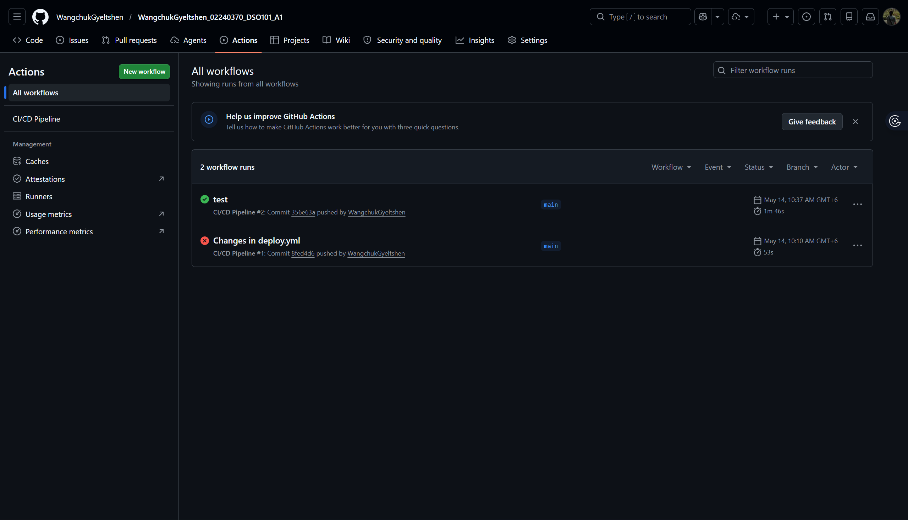
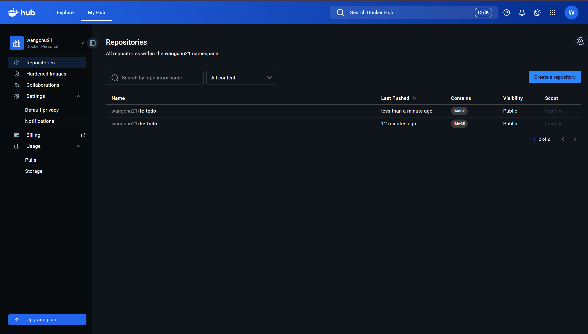

# Assignment III — CI/CD Pipeline with GitHub Actions, Docker & Render.com

**Course:** Continuous Integration and Continuous Deployment (DSO101)  
**Programme:** Bachelor's of Engineering in Software Engineering (SWE)  
**Student ID:** 02240370  

---

## Overview

This assignment involves setting up a full CI/CD pipeline for a To-Do List application that is split into a **Frontend (FE)** and **Backend (BE)**. The pipeline automatically builds Docker images, pushes them to DockerHub, and deploys them to Render.com whenever code is pushed to the `main` branch.

---

## Tools & Technologies

| Tool | Purpose |
|---|---|
| GitHub | Source code hosting |
| GitHub Actions | CI/CD automation |
| Docker | Containerization |
| DockerHub | Container image registry |
| Render.com | Cloud deployment |
| Node.js & npm | Backend runtime & package management |

---

## Repository Structure

```
your-repo/
├── .github/
│   └── workflows/
│       └── deploy.yml       # GitHub Actions CI/CD workflow
├── BE/
│   ├── Dockerfile
│   ├── package.json
│   └── index.js
├── FE/
│   ├── Dockerfile
│   └── ...
└── README.md
```

---

## Steps Taken

### Task 1 — Verify GitHub Repository Setup
- Confirmed the repository is **public** on GitHub.
- Verified that `package.json` contains the required `start` and `test` scripts for both the FE and BE.

### Task 2 — Verify Dockerfiles
- Confirmed that a `Dockerfile` exists in both the `BE/` and `FE/` folders.
- Each Dockerfile uses `node:20-alpine` as the base image, installs dependencies, runs tests, and starts the application.
- Tested both containers locally to verify they build and run correctly.

### Task 3 — Create GitHub Actions Workflow
- Created `.github/workflows/deploy.yml` at the root of the repository.
- The workflow is triggered on every push to the `main` branch.
- It performs the following steps:
  1. Checks out the repository code.
  2. Logs into DockerHub using GitHub Secrets.
  3. Builds and pushes the **Frontend** Docker image (`wangchu21/fe-todo:latest`).
  4. Builds and pushes the **Backend** Docker image (`wangchu21/be-todo:latest`).
  5. Triggers a redeployment on Render.com for both services via deploy hooks.

### Task 4 — Configure GitHub Secrets
Added the following secrets to the GitHub repository under **Settings → Secrets and variables → Actions**:

| Secret Name | Purpose |
|---|---|
| `DOCKERHUB_USERNAME` | DockerHub username |
| `DOCKERHUB_TOKEN` | DockerHub personal access token |
| `RENDER_DEPLOY_HOOK_FE` | Render.com deploy webhook for Frontend |
| `RENDER_DEPLOY_HOOK_BE` | Render.com deploy webhook for Backend |

### Task 5 — Deploy on Render.com
- Created two Web Services on Render.com — one for the FE and one for the BE.
- Selected **"Deploy from existing image"** and pointed each service to the respective DockerHub image.
- Copied the deploy hook URLs from Render and added them as GitHub Secrets.

---

## Challenges Faced

### GitHub Actions Not Triggering
The GitHub Actions workflow was not triggering initially on push. This was due to the `deploy.yml` file not being placed at the correct location. GitHub Actions only recognises workflows stored at `.github/workflows/` at the **root of the repository**, not inside subdirectories like `BE/` or `FE/`. Moving the file to the correct root-level path resolved the issue.

---

## Learning Outcomes

- **CI/CD Automation Concepts:** Gained a solid understanding of how Continuous Integration and Continuous Deployment works in a real-world workflow — from code commit to automated build, test, and deployment.
- **GitHub Actions Workflows:** Learned how to write and structure a `deploy.yml` file, use pre-built actions like `actions/checkout` and `docker/login-action`, and chain multiple steps in a single job.
- **Secrets Management:** Understood the importance of never hardcoding credentials and how to securely reference secrets in GitHub Actions using `${{ secrets.SECRET_NAME }}`.
- **Multi-service Deployment:** Gained experience managing separate FE and BE services with independent Docker images and Render deployments within a single pipeline.

---

## Screenshots


1. **Successful GitHub Actions Workflow**  
   

2. **DockerHub Pushed Images**  
   

---

## Deployment Links

| Service | URL |
|---|---|
| Frontend | https://fe-todo-02240370.onrender.com |
| Backend | https://be-todo-02240370-1.onrender.com |

---

## DockerHub Images

| Service | Image |
|---|---|
| Frontend | `wangchu21/fe-todo:latest` |
| Backend | `wangchu21/be-todo:latest` |